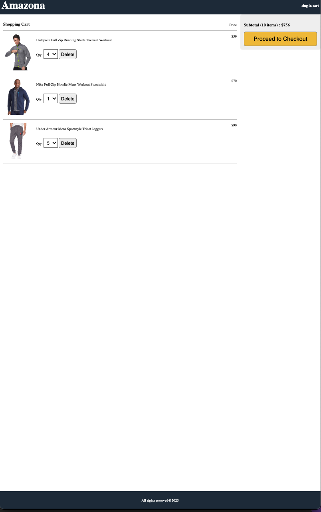

# E-Commerce JavaScript Application

This project is a simple e-commerce application built with JavaScript. It includes a frontend built with vanilla JavaScript and a backend built with Node.js.

## Features

- Product listing with pagination
- Product details with customer reviews
- Shopping cart functionality
- User authentication and profile management

## Demo

## Running the Application

1. Clone the repository:
2. Navigate to the project directory.
3. Start the backend server. run `npm install` in the main directory
4. Start the frontend. In a new terminal window, navigate to the `frontend` directory run `npm install`.

## Project Structure

- `backend/`: Contains the server-side code of the application.
- `frontend/`: Contains the client-side code of the application.
  - `public/`: Contains static files like images, HTML, and CSS.
  - `src/`: Contains the JavaScript source code.
- `api.js`: Contains API calls.
- `components/`: Contains reusable components like `rating.js`.
- `screens/`: Contains the different screens of the application like `homeScreen.js`, `productScreen.js`, etc.
- `utils.js`: Contains utility functions.

## Contributing

Contributions are welcome! Please fork the repository and create a pull request with your changes.

## License

This project is licensed under the MIT License.

## Contact

If you have any questions or feedback, please reach out to us at `hendy@nyu.edu`.
